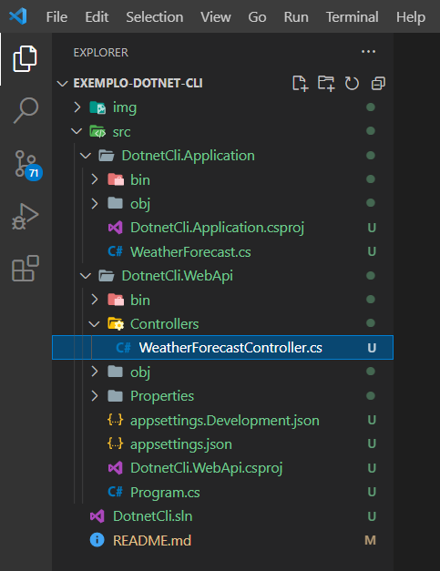
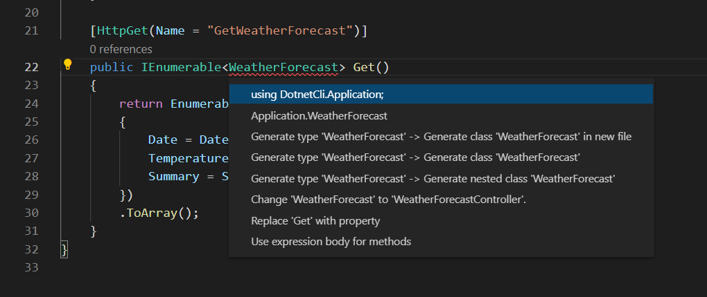
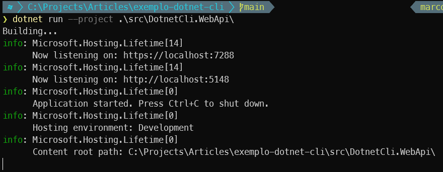
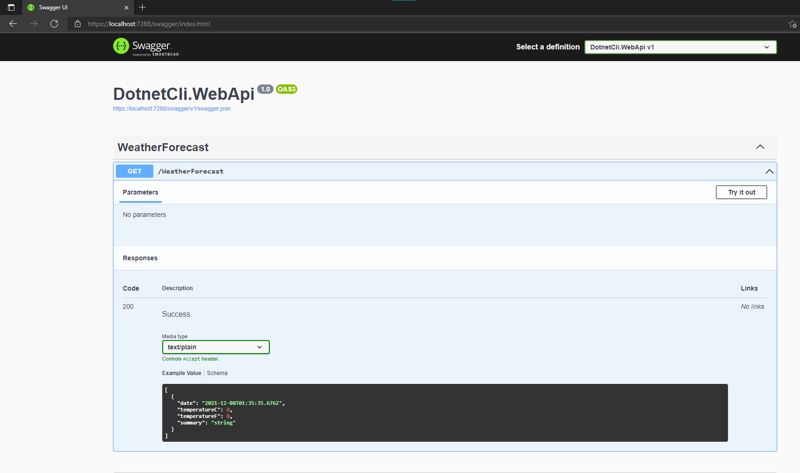

# Utilizando dotnet CLI para criar projetos no vscode

## Introdução 

O .NET é um framework Open Source (Isso mesmo, código aberto) para desenvolvimento de software, que pode ser utilizado no linux, mac e windows ...
e por ser multiplataforma conta com uma CLI (interface de linha de comando) para facilitar o desenvolvimento.

Neste artigo vamos conhecer alguns comandos e criar a estrutura de um projeto com .NET CLI

## Pré-requisitos

 + .NET 6.0
 + Visual Studio Code (VS Code) 
 
Estou utilizando o Windows Terminal onde podemos utilizar diferentes ferramentas e shells de linha de comando, mas você pode utilizar a ferramenta de sua preferência.

Podemos verificar se o .NET está instalado com o seguinte comando:

    dotnet --version

## Criando o projeto
Com o comando `dotnet new sln` vamos criar uma nova solução, utilizamos o parâmetro `-o "nome-do-diretório"` para informar o diretório que será criado, caso não informe o parâmetro `-o`  a solução será criada com o nome do diretório atual. Podemos utilizar também o parâmetro `-n` caso queira que a solução tenha um nome diferente do diretório atual.

    dotnet new sln -o exemplo-dotnet-cli -n DotnetCli

Nos próximos passos vamos adicionar no projeto uma biblioteca de classes e um uma API Web, seguindo a seguinte estrutura:

- DotnetCli.WebApi (webapi)
- DotnetCli.Application (classlib)

### Projeto classlib
Usamos o comando `dotnet new classlib` para cria uma biblioteca de classes, também vamos utilizar o parâmetro `-o` 

    dotnet new classlib -o src/DotnetCli.Application

### Projeto webapi

Com o comando `dotnet new webapi` vamos criar uma API Web.

    dotnet new webapi -o src/DotnetCli.WebApi

Agora vamos utilizar o comando `dotnet sln add` para adicionar projetos a solution, podemos repetir o comando para todos os projetos ou utilizar o um comando para adicionar vários projetos a uma solução:

### Adicionar um projeto por vez
	
    dotnet sln add .\src\DotnetCli.Application\

### Adicionar todos os projetos

Windows
    
    dotnet sln add (ls -r **/*csproj)

Unix/Linux

    dotnet sln add **/*.csproj  

Para que um projeto possa utilizar os recursos de um outro projeto precisamos criar uma referência entre eles, usamos o comando  `dotnet add "PROJETO1" reference "PROJETO2"`

    dotnet add .\src\DotnetCli.WebApi\ reference .\src\DotnetCli.Application\

No terminal podemos usar o comando `code .` no diretório do projeto para abrir o VS Code.
Vou deletar o arquivo Class1.cs do projeto DotnetCli.Application e mover o arquivo WeatherForecast.cs do projeto DotnetCli.WebApi para DotnetCli.Application.

Precisamos adicionar a referência da classe WeatherForecast.cs no arquivo WeatherForecastController.cs

O comando `dotnet build` Compila um projeto e todas as suas dependências
    
    dotnet build

E por fim o comando `dotnet run` Executa o código-fonte, utilizando o parâmetro `--project "DIRETORIO_DO_PROJETO"` para especificar o caminho do arquivo de projeto a ser executado.

    dotnet run --project .\src\DotnetCli.WebApi\

Podemos acessar pelo endereço `https://localhost:[PORTA]/swagger/index.html` verifique a porta que o projeto esta rodando em seu terminal.

## Conclusão

O **Visual Studio** é uma ferramenta poderosa mas o dotnet **não** é totalmente dependente da IDE, Podemos utilizar um terminal de nossa preferência combinado com o famoso VS code para construirmos soluções incríveis. Para se aprofundar um pouco mais consulte a documentação oficial - [Microsoft docs](https://docs.microsoft.com/pt-br/dotnet/core/tools/)
